## Hibernate Study
### annotation 注解
1. @Basic(optional: boolean, fetch: FetchType)
2. @Column(name: String, unique: boolean, nullable: boolean, insertable: boolean, updatable: boolean, columnDefinition: String, length: int, precision: int, scale: int)
   1. length: org.hibernate.Length 常量
3. @Formula(value: String) 指定为虚拟列只读
4. @Convert(converter: Class, attributeName: String, disableConversion: Boolean)
   1. 用在实体的属性上指定属性转换器
5. @Converter(autoApply: boolean)
   1. 用在定义属性转换器上
   2. autoApply是否自动应用
6. @JavaType
7. @JdbcTypeCode(value: int) 指定数据库对应的类型
   1. value: java.sql.Types 常量
8. @Type(value: Class<? extends UserType<?>>, parameters: Parameter[])
9. @Nationalized
10. @Lob
11. @ColumnTransformer 列转换器，可以实现读写加密
12. @Subselect(value: string) 将指定的SQL映射到实体
13. @Synchronize(value: String[]) 配合@Subselect()使用，指定关联到的表
14. @Proxy(proxyClass: Class<?>, lazy: boolean) 实现自定义代理实体类
15. @Persister(impl: Class<?>) 为实体指定相关的持久化器
16. @Transient() 将实体的字段排除持久化状态
17. @Version() 实现乐观锁
18. @Access(value: AccessType) 覆盖默认的访问策略
19. @EmbeddedId 在实体中为属性指定为复合主键
### 概述
#### Hibernate实现了JPA(Java Persistence API)
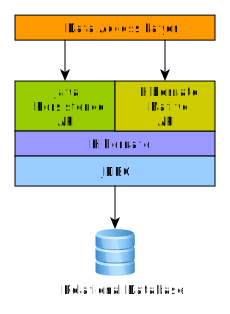
##### EntityManagerFactory 会话工厂，线程安全
   1. javax.persistence.EntityManagerFactory
   2. org.hibernate.SessionFactory Hibernate在javax.persistence.EntityManagerFactory之上又添加了其它的接口规范
   3. org.hibernate.internal.SessionFactoryImpl Hibernate对SessionFactory规范的实现
   4. 
##### EntityManager 会话，单线程，短期对象
   1. javax.persistence.EntityManager
   2. org.hibernate.Session
   3. org.hibernate.internal.SessionImpl
   4. 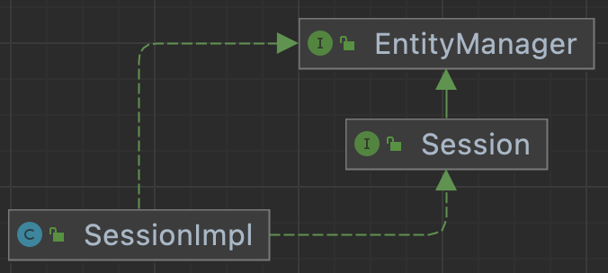
##### EntityTransaction 事务，单线程，短期对象
   1. javax.persistence.EntityTransaction
   2. org.hibernate.Transaction
   3. org.hibernate.internal.TransactionImpl
   4. 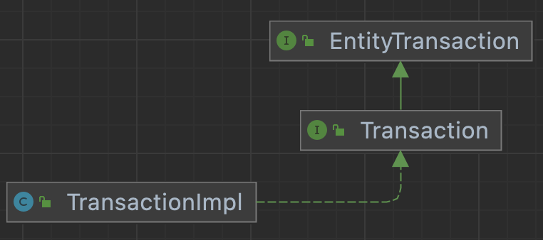
##### Type 数据库与Java类型的映射
   1. javax.persistence.Embeddable 注解 参见com.mzvzm.entity.Contact类
   2. org.hibernate.type.Type 接口，提供了定义映射类型的接口
   3. org.hibernate.type.AbstractType
   4. org.hibernate.type.BasicType 接口
   5. org.hibernate.type.AbstractSingleColumnStandardBasicType 单列标准类型基本接口
   6. 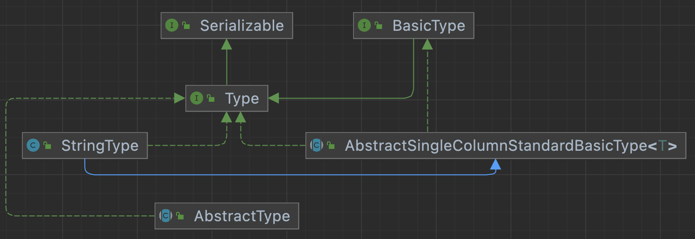
   7. 分类
      1. 值类型
      2. 实体类型
      3. 集合类型
### Domain Model
#### Basic values
##### enums
1. @Enumerated(value: EnumType) 参见 com.mzvzm.entity.Phone
   1. EnumType.ORDINAL 根据序号位置对应
   2. EnumType.STRING 根据名称对应
2. 自定义char转enum 参见 com.mzvzm.entity.Gender\com.mzvzm.entity.Person\com.mzvzm.converter.GenderConverter
3. 使用自定义枚举映射@Type(type = "GenderType.class") 参见 org.hibernate.annotations.Type com.mzvzm.converter.GenderConverter
##### boolean
1. org.hibernate.type.YesNoConverter
2. org.hibernate.type.TrueFalseConverter
3. org.hibernate.type.NumericBooleanConverter
4. jakarta.persistence.AttributeConverter
5. 配置@Convert(converter = org.hibernate.type.YesNoConverter.class)
##### Clob/NClob
1. 使用Clob类型映射大数据字段，需要通过ClobProxy.generateProxy()设置，通过Clob.getCharacterStream()获取字节流
2. 映射到String
3. 映射到char[]
4. NClob与Clob相同
##### blob
1. 将数据库blob映射Blob，需要通过BlobProxy.generateProxy()设置，通过Blob.getBinaryStream()获取二进制字节流
2. 映射byte[]
##### numeric
1. 使用Duration映射numeric/Duration/INTERVAL_SECOND
##### timestamp_utc
1. 使用java.time.Instant映射
##### date
1. 使用java.time.LocalDate映射date类型
##### timestamp
1. 使用java.time.LocalDateTime映射timestamp类型
##### time
1. 使用java.time.LocalTime映射到time
##### TIMESTAMP/TIMESTAMP_WITH_TIMEZONE
1. 使用java.time.OffsetDateTime映射到TIMESTAMP/TIMESTAMP_WITH_TIMEZONE
##### TIME/TIME_WITH_TIMEZONE
1. 使用java.time.OffsetTime映射到TIME/TIME_WITH_TIMEZONE
##### VARCHAR
1. 使用java.util.TimeZone映射VARCHAR
##### TIMESTAMP/TIMESTAMP_WITH_TIMEZONE
1. 使用java.time.ZonedDateTime
##### VARCHAR
1. 使用java.util.Currency映射VARCHAR
2. 使用java.util.Locale映射VARCHAR
3. 使用java.util.UUID映射VARCHAR
##### INET/BINARY
1. 使用java.net.InetAddress映射
##### JSON
1. 使用Map<String, String> @JdbcTypeCode(SqlTypes.JSON)
##### MutabilityPlan
1. @Mutability
2. @Immutable
3. @MapKeyMutability
4. @CollectionIdMutability
5. JavaType#getMutabilityPlan 获取类型
##### BasicValueConverter
1. org.hibernate.metamodel.model.convert.spi.BasicValueConverter
##### Resolving the composition
1. org.hibernate.mapping.BasicValue#buildResolution
2. org.hibernate.mapping.BasicValue.Resolution
##### 自定义类型映射
1. 实现org.hibernate.usertype.UserType并且配合@Type
2. 映射Map时，@Type描述Map的value，使用@MapKeyType描述Map的
3. 映射id-bag时，使用@Type描述元素的同时需要使用@CollectionIdType描述collection-id
##### 处理数据方言(Dialect)
1. org.hibernate.dialect.Dialect#getNationalizationSupport() 获取方言
##### 自定义属性转换器(Custom Converter)
1. 实现jakarta.persistence.AttributeConverter
2. 覆写#convertToDatabaseColumn与#convertToEntityAttribute方法
3. 在实体上使用@Convert(converter = PeriodStringConverter.class)
4. HBM配置文件<property name="balance" type="converted::com.mzvzm.converter.MoneyConverter"/>
5. 示例参见 com.mzvzm.converter.PeriodStringConverter, com.mzvzm.converter.MoneyConverter
##### 注册器(Registers)
1. org.hibernate.boot.model.TypeContributor
2. java.util.ServiceLoad
##### Case Study BitSet
1. 最坏的情况下回退到Serializable，BitSet也实现了Serializable
2. 方案
   1. 实现一个自定义属性转换器(方案一)
      1. BitSetHelper.bitSetToString(attribute);
      2. BitSetHelper.stringToBitSet(dbData);
   2. 自定义一个JavaType，使用JavaTypeDescriptor
      1. 继承AbstractClassJavaType
      2. 配合注解指定解析器
         1. 使用@JavaType()
         2. 使用@JavaTypeRegistration(javaType = BitSet.class, descriptorClass = BitSetJavaType.class)
         3. 使用@JdbcTypeCode(Types.VARBINARY)
         4. @JdbcTypeRegistration()
##### 生成属性
1. Hibernate 何时生成
   1. NEVER 不生成
   2. INSERT 插入时生成
   3. ALWAYS 在插入与更新时生成
2. Hibernate 生成策略
   1. @CurrentTimestamp 可以配置为INSERT/ALWAYS，使用数据库current_timestamp函数作为生成的值
   2. @CreationTimestamp 可以配置为INSERT，使用的是JVM当前时间戳
   3. @UpdateTimestamp 可以配置为INSERT，使用的是JVM当前时间戳，做为插入和更新的值
   4. @Generated 
3. 自定义生成策略
   1. 自定义注解@GeneratedUuidValue
      1. 使用@ValueGenerationType指定生成策略类
   2. 生成策略类实现AnnotationValueGeneration<>、ValueGenerator<>
   3. 使用自定义的注解实现
##### 列转换器
1. @ColumnTransformer
#### 可嵌入值embeddables
##### Component/Embedded
1. 组合多个基础类型，在多个实体中复用
##### Overriding Embeddable Types
1. 当一个可嵌入类型被多次使用时，可能会存在列表冲突问题，需要通过
2. 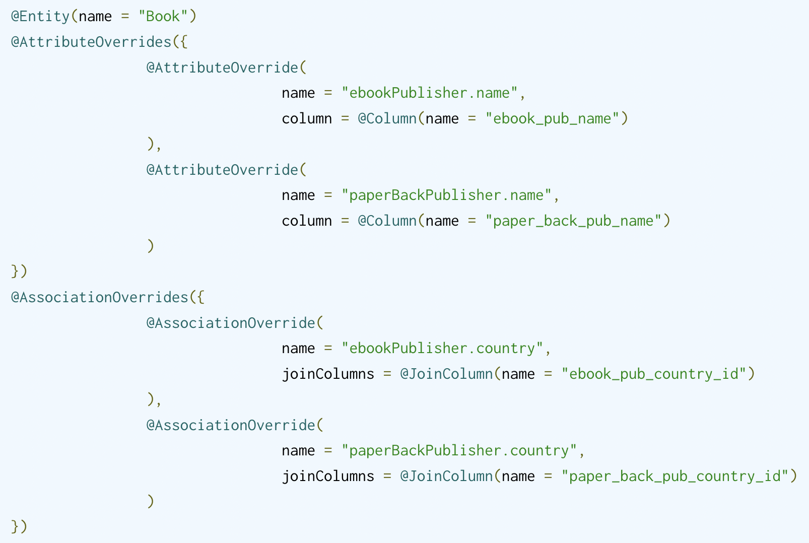
##### 关于Set的可嵌入类型
##### 关于Map的可嵌入类型
##### 关于复合标识符的可嵌入类型
##### @Target
1. 参见com.mzvzm.entity.Coordinates com.mzvzm.entity.GPS com.mzvzm.entity.City
2. @ManyToOne @OneToOne @OneToMany @ManyToMany @ElementCollection
##### @Parent
1. 可以在可嵌入对象中使用此注解获取父对象实体的引用
2. 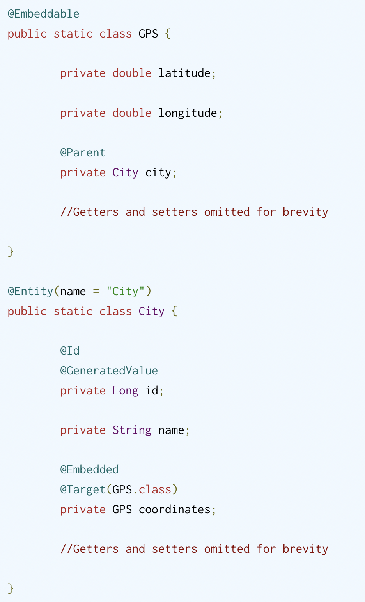
##### 自定义实例化
1. 创建可嵌入实体，私有化无参构造函数
2. 创建自定义实例化策略类，实现EmbeddableInstantiator并且重写instantiate(ValueAccess valueAccess, SessionFactoryImplementor sessionFactory) 参见com.mzvzm.instantiator.NameInstantiator
3. 使用自定义实例化策略
   1. 在对应的属性添加@EmbeddableInstantiator
   2. 在类上添加注解@EmbeddableInstantiatorRegistration(embeddableClass = xxx.class, instantiator = xxxInstantiator.class)
##### 可嵌入和隐式命名策略
1. org.hibernate.boot.model.naming.ImplicitNamingStrategyComponentPathImpl 路径策略命名
#### 实体类型
##### POJO Models
1. Java Persistence 2.1 规范
   1. 实体类必须使用jakarta.persistence.Entity
   2. 实体类必须具有公共或受保护的无参数构造函数。它也可以定义额外的构造函数
   3. 实体类必须是顶级类
   4. 不能将枚举或接口指定为实体类
   5. 实体类不能是最终的。实体类的任何方法或持久实例变量都不能是最终的
   6. 如果要远程使用实体实例作为分离对象，则实体类必须实现Serializable接口
   7. 抽象类和具体类都可以是实体。实体可以扩展非实体类以及实体类，非实体类可以扩展实体类
   8. 实体的持久状态由实例变量表示，它可能对应于 JavaBean 样式的属性。实例变量只能由实体实例本身从实体的方法中直接访问。实体的状态只能通过实体的访问器方法（getter/setter 方法）或其他业务方法提供给客户端
2. Hibernate 规范
   1. 实体类必须有一个无参数的构造函数，它可以是公共的、受保护的或包可见性。它也可以定义额外的构造函数
   2. 实体类不必是顶级类
   3. 从技术上讲，Hibernate 可以持久化最终类或具有最终持久状态访问器（getter/setter）方法的类。但是，这通常不是一个好主意，因为这样做会阻止 Hibernate 生成用于延迟加载实体的代理。
   4. Hibernate 不限制应用程序开发人员公开实例变量并从实体类本身外部引用它们。然而，这种范式的有效性充其量是值得商榷的。
##### 非final类
1. 因为hibernate的延迟懒加载需要通过运行代理实现，对于setter/getter也同样不应该使用final修改因为同样会破坏代码的懒加载
##### 实现无参构造函数
##### 为持久属性声明getter/setter
##### 提供标识符属性，并且为包装类型
##### 映射实体
##### equals()&hashCode()
1. 为了确保多个session加载同一个实体，需要通过hashCode()/equals()来判断是否具有相同的对象
##### Subselect()
1. 将实体映射到SQL查询上
2. 使用@Subselect()配合@Synchronize()
3. 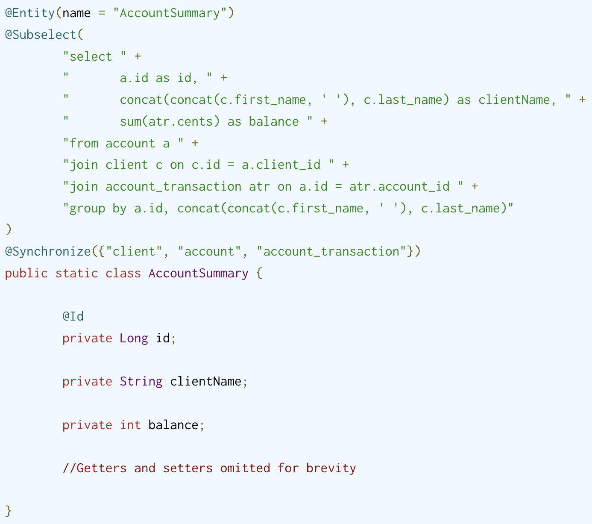
4. @Synchronize()
##### 定义自定义代实体代理
1. 定义一个接口
2. 在实体类上使用@Proxy(proxyClass = 定义的接口)
##### 定义一个自定义实体持久化器
1. @Persister 指定持久化器
2. 指定的持久化器必须实现EntityPersister接口/CollectionPersister接口
3. 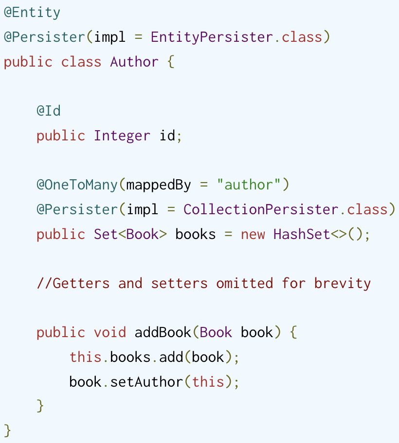
#### 命名策略
1. 用户通过注解@Table/@Column显示的指定名称
2. 不显示的指定名称也可以通过
   1. org.hibernate.cfg.NamingStrategy 已弃用
   2. org.hibernate.boot.model.naming.ImplicitNamingStrategy
   3. org.hibernate.boot.model.naming.ImplicitNamingStrategyJpaCompliantImpl jpa定义的隐匿命名规则
##### 隐式命名策略
1. 
2. 通过参数配置hibernate.implicit_naming_strategy以指定隐工命名策略
   1. default jpa: org.hibernate.boot.model.naming.ImplicitNamingStrategyJpaCompliantImpl
   2. jpa: org.hibernate.boot.model.naming.ImplicitNamingStrategyJpaCompliantImpl
   3. legacy-hbm: org.hibernate.boot.model.naming.ImplicitNamingStrategyLegacyHbmImpl
   4. legacy-jpa: org.hibernate.boot.model.naming.ImplicitNamingStrategyLegacyJpaImpl
   5. component-path: org.hibernate.boot.model.naming.ImplicitNamingStrategyComponentPathImpl主要遵循了ImplicitNamingStrategyJpaCompliantImpl，但是使用了完整的复合路径
3. 通过org.hibernate.boot.MetadataBuilder#applyImplicitNamingStrategy来指定要使用的ImplicitNamingStrategy
##### PhysicalNamingStrategy
1. org.hibernate.boot.model.naming.PhysicalNamingStrategy
   1. 喜欢下划线分隔的单词而不是驼峰式大小写
   2. 用标准缩写替换某些单词
2. 通过hibernate.physical_naming_strategy指定自己的实现类
3. 通过org.hibernate.boot.MetadataBuilder#applyPhysicalNamingStrategy指定自己的实现类
4. 参见 com.mzvzm.strategy.AcmeCorpPhysicalNamingStrategy
#### 访问策略
1. 作为 Jakarta Persistence 提供者，Hibernate 可以自省实体属性（实例字段）或访问器（实例属性）。默认情况下，@Id注释的位置会给出默认的访问策略。当放置在一个字段上时，Hibernate 将假定基于字段的访问。当放置在标识符 getter 上时，Hibernate 将使用基于属性的访问
2. 可嵌入类型从其父实体继承访问策略
##### 基于字段的访问
1. 添加其他实体级别的方法要灵活得多，因为 Hibernate 不会考虑持久状态的那些部分
2. 要将字段排除在实体持久状态的一部分之外，必须使用@Transient注释标记该字段
3. @Version
4. 使用基于字段的访问的另一个优点是可以从实体外部隐藏某些实体属性。
5. 使用基于字段的访问，我们可以简单地省略这个版本字段的 getter 和 setter，Hibernate 仍然可以利用乐观并发控制机制。
6. 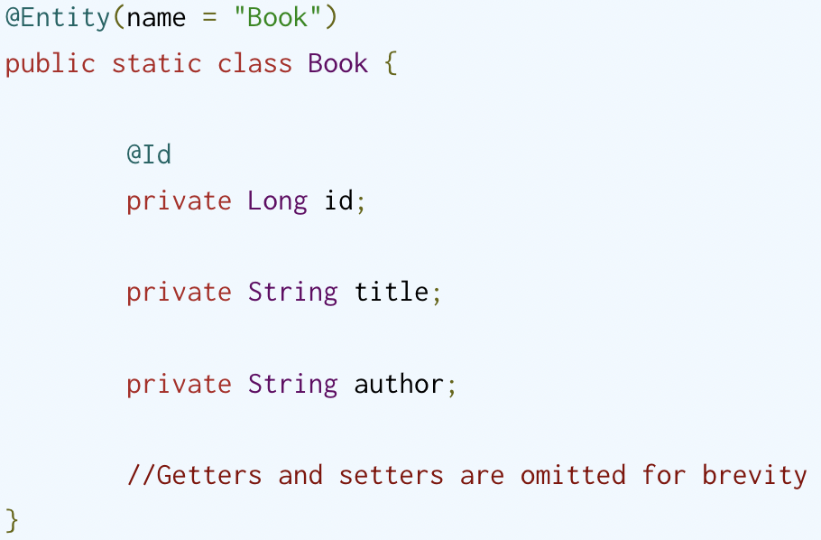
##### 基于属性的访问
1. 当使用基于属性的访问时，Hibernate 使用访问器来读取和写入实体状态。将添加到实体的所有其他方法（例如，用于同步双向一对多关联的两端的辅助方法）都必须使用@Transient注释进行标记。
2. 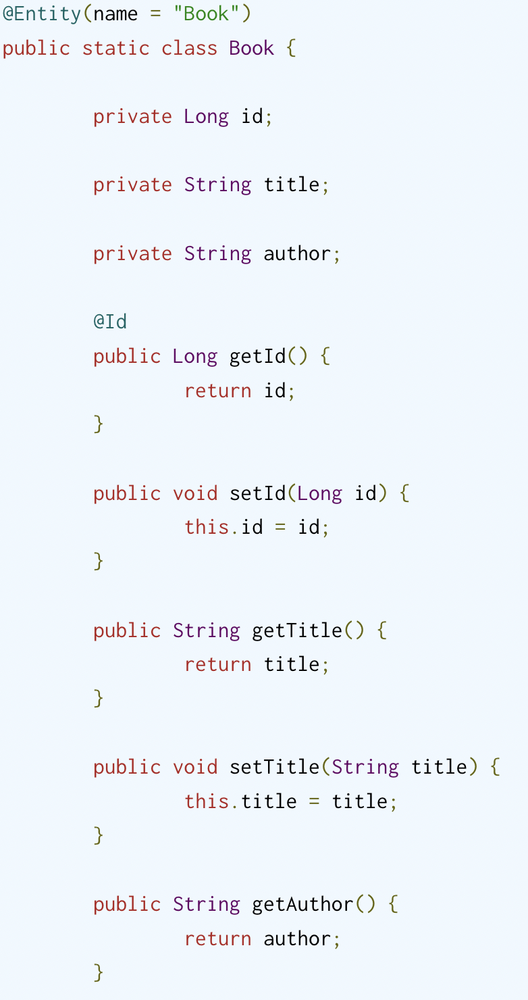
##### 覆盖默认的访问策略
1. 默认访问策略机制可以被 Jakarta Persistence@Access注解覆盖。
2. 
##### 可嵌入类型和访问策略
1. 由于可嵌入对象由其拥有的实体管理，因此访问策略也继承自实体。这适用于简单的可嵌入类型以及可嵌入的集合
2. 可嵌入类型可以否决默认的隐式访问策略（继承自拥有实体）
3. 
#### 身份标识
##### 简单标识符
1. 使用jakarta.persistence.Id注解
2. 支持做为Id的类型
   1. 任何 Java 原始类型 
   2. 任何原始包装类型 
   3. java.lang.String 
   4. java.util.Date( TemporalType#DATE)
   5. java.sql.Date 
   6. java.math.BigDecimal 
   7. java.math.BigInteger
   8. UUID Hibernate
3. 生成简单的标识符属性使用jakarta.persistence.GeneratedValue注解生成
##### 复合标识符
1. 主键类需要使用jakarta.persistence.EmbeddedId或jakarta.persistence.IdClass
2. 主键类必须是公共的，并且必须有一个公共的无参数构造函数。
3. 主键类必须是可序列化的
4. 主键类必须定义 equals 和 hashCode 方法，与主键映射到的基础数据库类型的相等性一致
5. Hibernate 确实允许通过多个属性在没有“主键类”的情况下定义复合标识符@Id，尽管这通常被认为是糟糕的设计
##### 复合标识符与@EmbeddedId
1. 使用 EmbeddedId 对复合标识符进行建模仅意味着将可嵌入对象定义为构成标识符的属性的组合，然后在实体上公开该可嵌入类型的属性。
2. 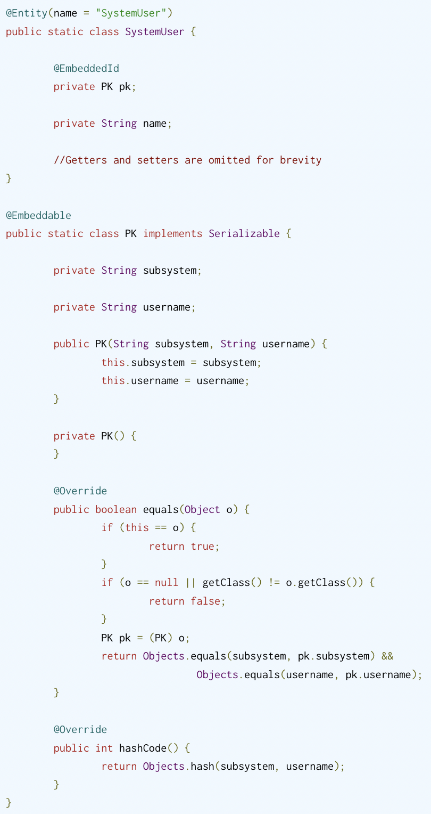
3. Hibernate 支持@ManyToOne在 Primary Key 类中直接建模关联，无论@EmbeddedId是@IdClas
4. 
##### 复合标识符与@IdClass
1. 使用 IdClass 对复合标识符建模与使用 EmbeddedId 的不同之处在于，实体定义了构成组合的每个单独的属性。IdClass 用作按 id 加载操作的标识符的表示
2. 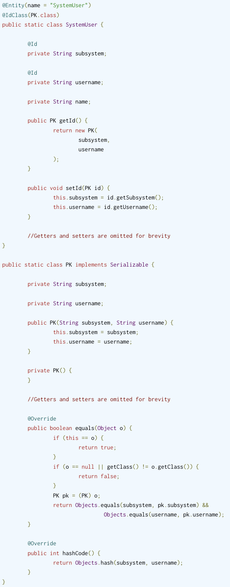
3. 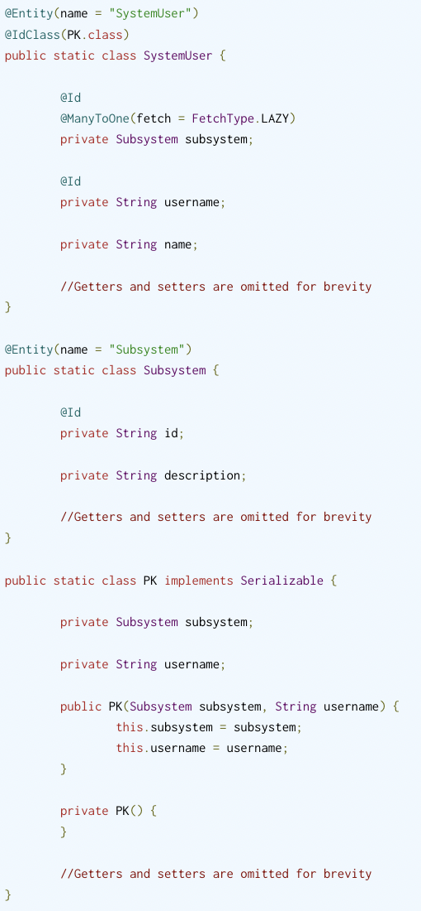
4. 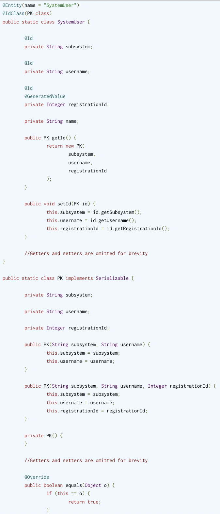
##### 2.7.5 具有关联的复合标识符
