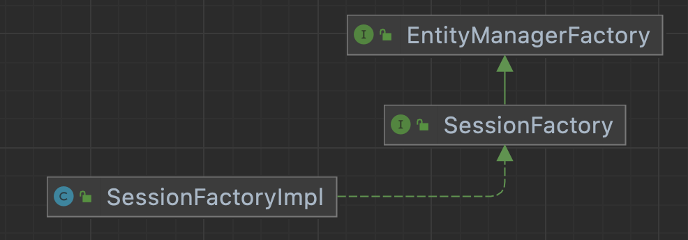
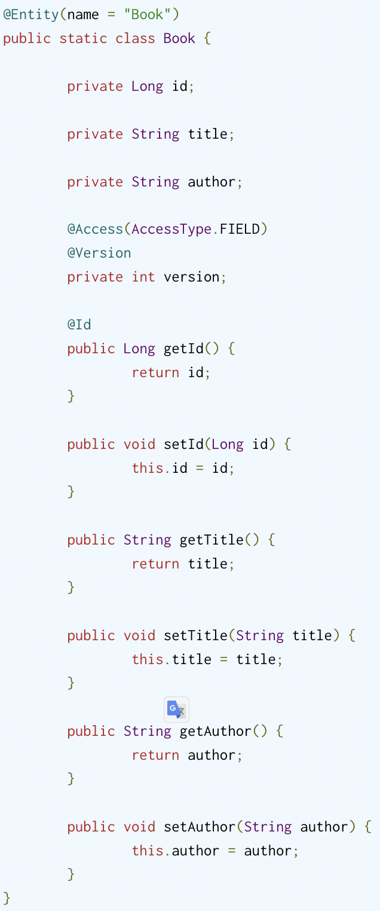

## Hibernate Study
### annotation 注解
1. @Basic(optional: boolean, fetch: FetchType)
2. @Column(name: String, unique: boolean, nullable: boolean, insertable: boolean, updatable: boolean, columnDefinition: String, length: int, precision: int, scale: int)
   1. length: org.hibernate.Length 常量
3. @Formula(value: String) 指定为虚拟列只读
4. @Convert(converter: Class, attributeName: String, disableConversion: Boolean)
   1. 用在实体的属性上指定属性转换器
5. @Converter(autoApply: boolean)
   1. 用在定义属性转换器上
   2. autoApply是否自动应用
6. @JavaType
7. @JdbcTypeCode(value: int) 指定数据库对应的类型
   1. value: java.sql.Types 常量
8. @Type(value: Class<? extends UserType<?>>, parameters: Parameter[])
9. @Nationalized
10. @Lob
11. @ColumnTransformer 列转换器，可以实现读写加密
12. @Subselect(value: string) 将指定的SQL映射到实体
13. @Synchronize(value: String[]) 配合@Subselect()使用，指定关联到的表
14. @Proxy(proxyClass: Class<?>, lazy: boolean) 实现自定义代理实体类
15. @Persister(impl: Class<?>) 为实体指定相关的持久化器
16. @Transient() 将实体的字段排除持久化状态
17. @Version() 实现乐观锁
18. @Access(value: AccessType) 覆盖默认的访问策略
19. @EmbeddedId 在实体中为属性指定为复合主键
20. @GeneratedValue(strategy: GenerationType, generator: String) 指定生成标识符的策略
21. @SequenceGenerator(name: String, sequenceName: String, catalog String, schema: String, initialValue: int, allocationSize: int) 指定使用Sequence做为id生成时此注解才有意义
22. @TableGenerator(name: String, table: String, catalog: String, schema: String, pkColumnName: String, valueColumnName: String, pkColumnValue: String, initialValue: int, allocationSize: int, uniqueConstraints: UniqueConstraint[], indexes: Index[]) 配合表生成器使用指定表生成的配置信息
23. @GenericGenerator(name: String, strategy: String, parameters: Parameter[]) 配合UUID生成器，指定相关参数
24. @MapsId(value: String) 派生标识符只允许一对一或多对一的情况下使用
25. @RowId(value: String) 需要数据库支持ROWID，在实体类上使用以指定ROWID
26. @ManyToOne(targetEntity: Class, cascade: CascadeType[], fetch: FetchType, optional: boolean)
27. @JoinColumn(name: String, referencedColumnName: String, unique: boolean, nullable: boolean, insertable: boolean, updatable: boolean, columnDefinition: String, table: String, foreignKey: ForeignKey)
28. @OneToMany(targetEntity: Class, cascade: CascadeType[], fetch: FetchType, mappedBy: String, orphanRemoval: boolean)
29. @OneToOne(targetEntity: Class, cascade: CascadeType[], fetch: FetchType, optional: boolean, mappedBy: String, orphanRemoval: boolean)
30. @LazyToOne(value: LazyToOneOption)
31. 
### 概述
#### Hibernate实现了JPA(Java Persistence API)

##### EntityManagerFactory 会话工厂，线程安全
   1. javax.persistence.EntityManagerFactory
   2. org.hibernate.SessionFactory Hibernate在javax.persistence.EntityManagerFactory之上又添加了其它的接口规范
   3. org.hibernate.internal.SessionFactoryImpl Hibernate对SessionFactory规范的实现
   4. 
##### EntityManager 会话，单线程，短期对象
   1. javax.persistence.EntityManager
   2. org.hibernate.Session
   3. org.hibernate.internal.SessionImpl
   4. 
##### EntityTransaction 事务，单线程，短期对象
   1. javax.persistence.EntityTransaction
   2. org.hibernate.Transaction
   3. org.hibernate.internal.TransactionImpl
   4. 
##### Type 数据库与Java类型的映射
   1. javax.persistence.Embeddable 注解 参见com.mzvzm.entity.Contact类
   2. org.hibernate.type.Type 接口，提供了定义映射类型的接口
   3. org.hibernate.type.AbstractType
   4. org.hibernate.type.BasicType 接口
   5. org.hibernate.type.AbstractSingleColumnStandardBasicType 单列标准类型基本接口
   6. 
   7. 分类
      1. 值类型
      2. 实体类型
      3. 集合类型
### Domain Model
#### Basic values
##### enums
1. @Enumerated(value: EnumType) 参见 com.mzvzm.entity.Phone
   1. EnumType.ORDINAL 根据序号位置对应
   2. EnumType.STRING 根据名称对应
2. 自定义char转enum 参见 com.mzvzm.entity.Gender\com.mzvzm.entity.Person\com.mzvzm.converter.GenderConverter
3. 使用自定义枚举映射@Type(type = "GenderType.class") 参见 org.hibernate.annotations.Type com.mzvzm.converter.GenderConverter
##### boolean
1. org.hibernate.type.YesNoConverter
2. org.hibernate.type.TrueFalseConverter
3. org.hibernate.type.NumericBooleanConverter
4. jakarta.persistence.AttributeConverter
5. 配置@Convert(converter = org.hibernate.type.YesNoConverter.class)
##### Clob/NClob
1. 使用Clob类型映射大数据字段，需要通过ClobProxy.generateProxy()设置，通过Clob.getCharacterStream()获取字节流
2. 映射到String
3. 映射到char[]
4. NClob与Clob相同
##### blob
1. 将数据库blob映射Blob，需要通过BlobProxy.generateProxy()设置，通过Blob.getBinaryStream()获取二进制字节流
2. 映射byte[]
##### numeric
1. 使用Duration映射numeric/Duration/INTERVAL_SECOND
##### timestamp_utc
1. 使用java.time.Instant映射
##### date
1. 使用java.time.LocalDate映射date类型
##### timestamp
1. 使用java.time.LocalDateTime映射timestamp类型
##### time
1. 使用java.time.LocalTime映射到time
##### TIMESTAMP/TIMESTAMP_WITH_TIMEZONE
1. 使用java.time.OffsetDateTime映射到TIMESTAMP/TIMESTAMP_WITH_TIMEZONE
##### TIME/TIME_WITH_TIMEZONE
1. 使用java.time.OffsetTime映射到TIME/TIME_WITH_TIMEZONE
##### VARCHAR
1. 使用java.util.TimeZone映射VARCHAR
##### TIMESTAMP/TIMESTAMP_WITH_TIMEZONE
1. 使用java.time.ZonedDateTime
##### VARCHAR
1. 使用java.util.Currency映射VARCHAR
2. 使用java.util.Locale映射VARCHAR
3. 使用java.util.UUID映射VARCHAR
##### INET/BINARY
1. 使用java.net.InetAddress映射
##### JSON
1. 使用Map<String, String> @JdbcTypeCode(SqlTypes.JSON)
##### MutabilityPlan
1. @Mutability
2. @Immutable
3. @MapKeyMutability
4. @CollectionIdMutability
5. JavaType#getMutabilityPlan 获取类型
##### BasicValueConverter
1. org.hibernate.metamodel.model.convert.spi.BasicValueConverter
##### Resolving the composition
1. org.hibernate.mapping.BasicValue#buildResolution
2. org.hibernate.mapping.BasicValue.Resolution
##### 自定义类型映射
1. 实现org.hibernate.usertype.UserType并且配合@Type
2. 映射Map时，@Type描述Map的value，使用@MapKeyType描述Map的
3. 映射id-bag时，使用@Type描述元素的同时需要使用@CollectionIdType描述collection-id
##### 处理数据方言(Dialect)
1. org.hibernate.dialect.Dialect#getNationalizationSupport() 获取方言
##### 自定义属性转换器(Custom Converter)
1. 实现jakarta.persistence.AttributeConverter
2. 覆写#convertToDatabaseColumn与#convertToEntityAttribute方法
3. 在实体上使用@Convert(converter = PeriodStringConverter.class)
4. HBM配置文件<property name="balance" type="converted::com.mzvzm.converter.MoneyConverter"/>
5. 示例参见 com.mzvzm.converter.PeriodStringConverter, com.mzvzm.converter.MoneyConverter
##### 注册器(Registers)
1. org.hibernate.boot.model.TypeContributor
2. java.util.ServiceLoad
##### Case Study BitSet
1. 最坏的情况下回退到Serializable，BitSet也实现了Serializable
2. 方案
   1. 实现一个自定义属性转换器(方案一)
      1. BitSetHelper.bitSetToString(attribute);
      2. BitSetHelper.stringToBitSet(dbData);
   2. 自定义一个JavaType，使用JavaTypeDescriptor
      1. 继承AbstractClassJavaType
      2. 配合注解指定解析器
         1. 使用@JavaType()
         2. 使用@JavaTypeRegistration(javaType = BitSet.class, descriptorClass = BitSetJavaType.class)
         3. 使用@JdbcTypeCode(Types.VARBINARY)
         4. @JdbcTypeRegistration()
##### 生成属性
1. Hibernate 何时生成
   1. NEVER 不生成
   2. INSERT 插入时生成
   3. ALWAYS 在插入与更新时生成
2. Hibernate 生成策略
   1. @CurrentTimestamp 可以配置为INSERT/ALWAYS，使用数据库current_timestamp函数作为生成的值
   2. @CreationTimestamp 可以配置为INSERT，使用的是JVM当前时间戳
   3. @UpdateTimestamp 可以配置为INSERT，使用的是JVM当前时间戳，做为插入和更新的值
   4. @Generated 
3. 自定义生成策略
   1. 自定义注解@GeneratedUuidValue
      1. 使用@ValueGenerationType指定生成策略类
   2. 生成策略类实现AnnotationValueGeneration<>、ValueGenerator<>
   3. 使用自定义的注解实现
##### 列转换器
1. @ColumnTransformer
#### 可嵌入值embeddables
##### Component/Embedded
1. 组合多个基础类型，在多个实体中复用
##### Overriding Embeddable Types
1. 当一个可嵌入类型被多次使用时，可能会存在列表冲突问题，需要通过
2. 
##### 关于Set的可嵌入类型
##### 关于Map的可嵌入类型
##### 关于复合标识符的可嵌入类型
##### @Target
1. 参见com.mzvzm.entity.Coordinates com.mzvzm.entity.GPS com.mzvzm.entity.City
2. @ManyToOne @OneToOne @OneToMany @ManyToMany @ElementCollection
##### @Parent
1. 可以在可嵌入对象中使用此注解获取父对象实体的引用
2. 
##### 自定义实例化
1. 创建可嵌入实体，私有化无参构造函数
2. 创建自定义实例化策略类，实现EmbeddableInstantiator并且重写instantiate(ValueAccess valueAccess, SessionFactoryImplementor sessionFactory) 参见com.mzvzm.instantiator.NameInstantiator
3. 使用自定义实例化策略
   1. 在对应的属性添加@EmbeddableInstantiator
   2. 在类上添加注解@EmbeddableInstantiatorRegistration(embeddableClass = xxx.class, instantiator = xxxInstantiator.class)
##### 可嵌入和隐式命名策略
1. org.hibernate.boot.model.naming.ImplicitNamingStrategyComponentPathImpl 路径策略命名
#### 实体类型
##### POJO Models
1. Java Persistence 2.1 规范
   1. 实体类必须使用jakarta.persistence.Entity
   2. 实体类必须具有公共或受保护的无参数构造函数。它也可以定义额外的构造函数
   3. 实体类必须是顶级类
   4. 不能将枚举或接口指定为实体类
   5. 实体类不能是最终的。实体类的任何方法或持久实例变量都不能是最终的
   6. 如果要远程使用实体实例作为分离对象，则实体类必须实现Serializable接口
   7. 抽象类和具体类都可以是实体。实体可以扩展非实体类以及实体类，非实体类可以扩展实体类
   8. 实体的持久状态由实例变量表示，它可能对应于 JavaBean 样式的属性。实例变量只能由实体实例本身从实体的方法中直接访问。实体的状态只能通过实体的访问器方法（getter/setter 方法）或其他业务方法提供给客户端
2. Hibernate 规范
   1. 实体类必须有一个无参数的构造函数，它可以是公共的、受保护的或包可见性。它也可以定义额外的构造函数
   2. 实体类不必是顶级类
   3. 从技术上讲，Hibernate 可以持久化最终类或具有最终持久状态访问器（getter/setter）方法的类。但是，这通常不是一个好主意，因为这样做会阻止 Hibernate 生成用于延迟加载实体的代理。
   4. Hibernate 不限制应用程序开发人员公开实例变量并从实体类本身外部引用它们。然而，这种范式的有效性充其量是值得商榷的。
##### 非final类
1. 因为hibernate的延迟懒加载需要通过运行代理实现，对于setter/getter也同样不应该使用final修改因为同样会破坏代码的懒加载
##### 实现无参构造函数
##### 为持久属性声明getter/setter
##### 提供标识符属性，并且为包装类型
##### 映射实体
##### equals()&hashCode()
1. 为了确保多个session加载同一个实体，需要通过hashCode()/equals()来判断是否具有相同的对象
##### Subselect()
1. 将实体映射到SQL查询上
2. 使用@Subselect()配合@Synchronize()
3. 
4. @Synchronize()
##### 定义自定义代实体代理
1. 定义一个接口
2. 在实体类上使用@Proxy(proxyClass = 定义的接口)
##### 定义一个自定义实体持久化器
1. @Persister 指定持久化器
2. 指定的持久化器必须实现EntityPersister接口/CollectionPersister接口
3. 
#### 命名策略
1. 用户通过注解@Table/@Column显示的指定名称
2. 不显示的指定名称也可以通过
   1. org.hibernate.cfg.NamingStrategy 已弃用
   2. org.hibernate.boot.model.naming.ImplicitNamingStrategy
   3. org.hibernate.boot.model.naming.ImplicitNamingStrategyJpaCompliantImpl jpa定义的隐匿命名规则
##### 隐式命名策略
1. 
2. 通过参数配置hibernate.implicit_naming_strategy以指定隐工命名策略
   1. default jpa: org.hibernate.boot.model.naming.ImplicitNamingStrategyJpaCompliantImpl
   2. jpa: org.hibernate.boot.model.naming.ImplicitNamingStrategyJpaCompliantImpl
   3. legacy-hbm: org.hibernate.boot.model.naming.ImplicitNamingStrategyLegacyHbmImpl
   4. legacy-jpa: org.hibernate.boot.model.naming.ImplicitNamingStrategyLegacyJpaImpl
   5. component-path: org.hibernate.boot.model.naming.ImplicitNamingStrategyComponentPathImpl主要遵循了ImplicitNamingStrategyJpaCompliantImpl，但是使用了完整的复合路径
3. 通过org.hibernate.boot.MetadataBuilder#applyImplicitNamingStrategy来指定要使用的ImplicitNamingStrategy
##### PhysicalNamingStrategy
1. org.hibernate.boot.model.naming.PhysicalNamingStrategy
   1. 喜欢下划线分隔的单词而不是驼峰式大小写
   2. 用标准缩写替换某些单词
2. 通过hibernate.physical_naming_strategy指定自己的实现类
3. 通过org.hibernate.boot.MetadataBuilder#applyPhysicalNamingStrategy指定自己的实现类
4. 参见 com.mzvzm.strategy.AcmeCorpPhysicalNamingStrategy
#### 访问策略
1. 作为 Jakarta Persistence 提供者，Hibernate 可以自省实体属性（实例字段）或访问器（实例属性）。默认情况下，@Id注释的位置会给出默认的访问策略。当放置在一个字段上时，Hibernate 将假定基于字段的访问。当放置在标识符 getter 上时，Hibernate 将使用基于属性的访问
2. 可嵌入类型从其父实体继承访问策略
##### 基于字段的访问
1. 添加其他实体级别的方法要灵活得多，因为 Hibernate 不会考虑持久状态的那些部分
2. 要将字段排除在实体持久状态的一部分之外，必须使用@Transient注释标记该字段
3. @Version
4. 使用基于字段的访问的另一个优点是可以从实体外部隐藏某些实体属性。
5. 使用基于字段的访问，我们可以简单地省略这个版本字段的 getter 和 setter，Hibernate 仍然可以利用乐观并发控制机制。
6. 
##### 基于属性的访问
1. 当使用基于属性的访问时，Hibernate 使用访问器来读取和写入实体状态。将添加到实体的所有其他方法（例如，用于同步双向一对多关联的两端的辅助方法）都必须使用@Transient注释进行标记。
2. 
##### 覆盖默认的访问策略
1. 默认访问策略机制可以被 Jakarta Persistence@Access注解覆盖。
2. 
##### 可嵌入类型和访问策略
1. 由于可嵌入对象由其拥有的实体管理，因此访问策略也继承自实体。这适用于简单的可嵌入类型以及可嵌入的集合
2. 可嵌入类型可以否决默认的隐式访问策略（继承自拥有实体）
3. 
#### 身份标识
##### 简单标识符
1. 使用jakarta.persistence.Id注解
2. 支持做为Id的类型
   1. 任何 Java 原始类型 
   2. 任何原始包装类型 
   3. java.lang.String 
   4. java.util.Date( TemporalType#DATE)
   5. java.sql.Date 
   6. java.math.BigDecimal 
   7. java.math.BigInteger
   8. UUID Hibernate
3. 生成简单的标识符属性使用jakarta.persistence.GeneratedValue注解生成
##### 复合标识符
1. 主键类需要使用jakarta.persistence.EmbeddedId或jakarta.persistence.IdClass
2. 主键类必须是公共的，并且必须有一个公共的无参数构造函数。
3. 主键类必须是可序列化的
4. 主键类必须定义 equals 和 hashCode 方法，与主键映射到的基础数据库类型的相等性一致
5. Hibernate 确实允许通过多个属性在没有“主键类”的情况下定义复合标识符@Id，尽管这通常被认为是糟糕的设计
##### 复合标识符与@EmbeddedId
1. 使用 EmbeddedId 对复合标识符进行建模仅意味着将可嵌入对象定义为构成标识符的属性的组合，然后在实体上公开该可嵌入类型的属性。
2. 
3. Hibernate 支持@ManyToOne在 Primary Key 类中直接建模关联，无论@EmbeddedId是@IdClas
4. 
##### 复合标识符与@IdClass
1. 使用 IdClass 对复合标识符建模与使用 EmbeddedId 的不同之处在于，实体定义了构成组合的每个单独的属性。IdClass 用作按 id 加载操作的标识符的表示
2. 
3. 
4. 
##### 具有关联的复合标识符
1. 
2. 
3. 
4. 
5. 尽管映射比使用@EmbeddedId或@IdClass简单得多，但实体实例和实际标识符之间没有分离
6. 要查询此实体，必须将实体本身的实例提供给持久化上下文
##### 具有生成属性的复合标识符
1. 使用复合标识符时，基础标识符属性必须由用户手动分配。 
2. 不支持使用自动生成的属性来生成构成复合标识符的基础属性的值。 
3. 因此，您不能使用生成的属性部分描述的任何自动属性生成器，例如@Generated、@CreationTimestamp或@ValueGenerationType或数据库生成的值。 
4. 尽管如此，您仍然可以在构造复合标识符之前生成标识符属性，如以下示例所示。 
5. 假设我们有以下EventId复合标识符和一个Event使用上述复合标识符的实体。
##### 生成的标识符值
1. 使用jakarta.persistence.GeneratedValue(strategy: GenerationType), GenerationType.TABLE | GenerationType.SEQUENCE | GenerationType.IDENTITY | GenerationType.AUTO
   1. AUTO (默认) 表示持久化提供者（Hibernate）应该选择一个合适的生成策略
      1. 持久性提供者如何解释 AUTO 生成类型由提供者决定
      2. 默认行为是查看标识符属性的 Java 类型，以及底层数据库支持的内容
      3. 如果标识符类型是 UUID，Hibernate 将使用UUID 标识符
      4. 如果标识符类型是数字的（例如Long, Integer），如果底层数据库支持序列，那么 Hibernate 将使用其SequenceStyleGenerator解析为 SEQUENCE 生成，否则使用基于表的生成
   2. IDENTITY 指示数据库 IDENTITY 列将用于生成主键值
      1. 为了实现基于 IDENTITY 列的标识符值生成，Hibernate 使用其**org.hibernate.id.IdentityGenerator** id生成器，该生成器期望标识符由 INSERT 生成到表中。IdentityGenerator 了解可以检索 INSERT 生成的值的 3 种不同方式
         1. 如果 Hibernate 认为 JDBC 环境支持java.sql.Statement#getGeneratedKeys，那么该方法将用于提取 IDENTITY 生成的密钥
         2. 如果Dialect#supportsInsertSelectIdentity报告为真，Hibernate 将使用方言特定的 INSERT+SELECT 语句语法
         3. Hibernate 将期望数据库支持通过单独的 SQL 命令请求最近插入的 IDENTITY 值的某种形式，如 所示Dialect#getIdentitySelectStrin
      2. 选择 IDENTITY 生成还有另一个重要的运行时影响：Hibernate 将无法为使用 IDENTITY 生成的实体批处理 INSERT 语句
      3. 重要的是要意识到使用 IDENTITY 列强加了一种运行时行为，其中实体行必须在标识符值已知之前物理插入
      4. 这可能会弄乱扩展的持久性上下文（长时间的对话）。由于运行时强加/不一致，Hibernate 建议将其他形式的标识符值生成（例如 SEQUENCE）与扩展上下文一起使用
      5. 选择 IDENTITY 生成还有另一个重要的运行时影响：Hibernate 将无法为使用 IDENTITY 生成的实体批处理 INSERT 语句
   3. SEQUENCE 指示应使用数据库序列来获取主键值
      1. 为了实现基于数据库序列的标识符值生成，Hibernate 使用了它的 org.hibernate.id.enhanced.SequenceStyleGenerator id生成器。需要注意的是SequenceStyleGenerator，它能够通过透明地切换到作为底层支持的表来处理不支持序列的数据库，这为 Hibernate 提供了跨数据库的高度可移植性，同时仍然保持一致的 id 生成行为（而不是在序列和身份）
      2. 
      3. 使用@Subselect映射时，使用“表名”是无效的，因此 Hibernate 回退到使用实体名作为基础以及_seq后缀
      4. 
      5. 
   4. TABLE 指示应使用数据库表来获取主键值
      1. 
      2. 
##### 使用UUID生成
1. org.hibernate.id.UUIDGenerator id生成器支持
2. 
3. 
##### **优化器**
大多数从数据库结构中单独获取标识符值的 Hibernate 生成器都支持使用可插入优化器。优化器帮助管理 Hibernate 必须与数据库对话以生成标识符值的次数。例如，在没有优化器应用于序列生成器的情况下，每次应用程序要求 Hibernate 生成标识符时，它都需要从数据库中获取下一个序列值。但是如果我们可以尽量减少这里需要与数据库通信的次数，应用程序就能更好地执行，这其实就是这些优化器的作用
1. none: 不执行优化
2. pooled-lo: pooled-lo 优化器的工作原理是将增量值编码到数据库表/序列结构中。在序列术语中，这意味着序列是用大于 1 的增量大小定义的
   1. 例如，考虑一个定义为 的全新序列create sequence m_sequence start with 1 increment by 20。这个序列本质上定义了一个包含 20 个可用 id 值的“池”，每次我们询问它的下一个值时。pooled-lo 优化器将下一个值解释为该池的低端
   2. 因此，当我们第一次要求它提供下一个值时，我们会得到 1。然后我们假设有效池将是 1-20 的值（包括 1-20）
   3. 对序列的下一次调用将产生 21，它将 21-40 定义为有效范围。等等。名称的“lo”部分表示来自数据库表/序列的值被解释为池 lo(w) end
3. pooled: 就像 pooled-lo 一样，只是这里表/序列中的值被解释为值池的高端
4. hilo | legacy-hilo: 定义自定义算法，用于根据表或序列中的单个值生成值池，不推荐使用这些优化器。在这里维护（和提及）它们只是为了供以前使用这些策略的遗留应用程序使用
5. 应用程序还可以实现和使用它们自己的优化器策略，如org.hibernate.id.enhanced.Optimizer合约所定义
##### 使用@IdGeneratorType
1. 
2. 注意CustomSequenceGenerator构造函数。@IdGeneratorType 通过接收以下参数定义的自定义生成器：
   1. 配置注释 - 这里，@Sequence. 这是类型安全方面，而不是依赖于 Map 中的无类型配置属性等。 
   2. Member应用注释的。这允许访问标识符属性等的 Java 类型。 
   3. CustomIdGeneratorCreationContext是一个“参数对象”，提供对标识符生成器通常有用的事物的访问
##### 使用@GenericGenerator
1. @GenericGenerator通常认为不推荐使用@IdGeneratorType 
2. @GenericGenerator允许集成任何 Hibernate org.hibernate.id.IdentifierGenerator实现，包括此处讨论的任何特定实现和任何自定义实现
3. 
##### 派生标识符@MapsId
1. 
##### 派生标识符@PrimaryKeyJoinColumn
1. 
2. 与@MapsId的区别
   1. 与@MapsId不同的是，应用程序开发人员负责确保实体标识符和多对一（或一对一）关联是同步的，正如您在PersonDetails#setPerson方法中看到的那样
##### @RowId
1. 如果您使用注解对给定实体进行@RowId注解，并且底层数据库支持通过 ROWID（例如 Oracle）获取记录，那么 Hibernate 可以使用ROWID伪列进行 CRUD 操作
2. 
3. 需要数据库支持
#### Associations 关联
关联描述了两个或多个实体如何基于数据库关系的实现
##### @ManyToOne
1. 用于描述数据库中多对一的实体
2. 
3. @JoinColumn配合@ManyToOne使用
##### @OneToMany
1. 关联将父实体与一个或多个子实体链接起来
2. 单向关联：当使用单向@OneToMany关联时，Hibernate 使用两个连接实体之间的链接表
   1. 
   2. 
   3. 关联根据@OneToMany定义是父关联，无论它是单向的还是双向的。只有关联的父级才有意义将其实体状态转换级联到子级
   4. 
   5. 
   6. 在持久化Person实体时，级联也会将持久化操作传播到底层Phone子级。Phone从电话集合中删除 a后，关联行将从链接表中删除，并且该orphanRemoval属性也将触发Phone删除
   7. 在删除子实体时，单向关联不是很有效。在上面的示例中，在刷新持久性上下文时，Hibernate 从链接表中删除所有Person_Phone与父Person实体相关联的数据库行（例如 ），并重新插入仍然在@OneToMany集合中找到的行
3. 双向关联：双向@OneToMany关联也需要@ManyToOne子方的关联。尽管域模型暴露了两个方面来导航这种关联，但在幕后，关系数据库对于这种关系只有一个外键。
   1. 
   2. 
   3. 
   4. 每当形成双向关联时，应用程序开发人员必须确保双方始终保持同步
   5. addPhone()and removePhone()是在添加或删除子元素时同步两端的实用方法
   6. 因为Phone该类有一个@NaturalId列（电话号码是唯一的），equals()并且hashCode()可以利用这个属性，所以removePhone()逻辑简化为remove()JavaCollection方法
   7. 
   8. 与单向关联不同@OneToMany，双向关联在管理集合持久状态时效率更高。每个元素删除只需要一次更新（其中外键列设置NULL为orphanRemoval属性和分离子级也会触发实际子表行上的删除语句
##### @OneToOne
1. OneToOne关联可以是单向的，也可以是双向的。单向关联遵循关系数据库外键语义，客户端拥有关系。双向关联也具有mappedBy @OneToOne父端
2. 单向关联
   1. 
   2. 
   3. 从关系数据库的角度来看，底层模式与单向@ManyToOne关联相同，因为客户端根据外键列控制关系
   4. 但是，将其Phone视为客户端和PhoneDetails父方是不寻常的，因为如果没有实际的电话，细节就无法存在。一个更自然的映射将是Phone父端，因此将外键推入PhoneDetails表中
3. 双向关联
   1. 
   2. 
   3. 
4. 双向@OneToOne关联惰性加载
   1. 
   2. 
##### @ManyToMany
1. @ManyToMany关联需要一个连接两个实体的链接表
2. 单向关联
   1. 
   2. 
   3. 当从@ManyToMany集合中删除一个实体时，Hibernate 只是删除链接表中的连接记录
   4. 不幸的是，此操作需要**删除与给定父项关联的所有条目**并**重新创建当前运行的持久上下文中列出的条目**
   5. 对于@ManyToMany关联，REMOVE级联的实体状态转换没有意义，因为它会传播到链接表之外。由于另一方可能被父方的其他实体引用，因此自动删除可能以ConstraintViolationException
   6. 
3. 双向关联
   1. 
   2. 
   3. 
   4. 使用辅助方法完成双向关联操作
   5. 
   6. 
   7. 如果双向@OneToMany关联在删除或更改**子元素的顺序时表现更好**，则@ManyToMany关系无法从这种优化中受益，因为外键端不受控制
   8. 为了克服这个限制，必须直接公开链接表，并将@ManyToMany关联拆分为两个双向@OneToMany关系
4. 具有链接实体的双向多对多
   1. 